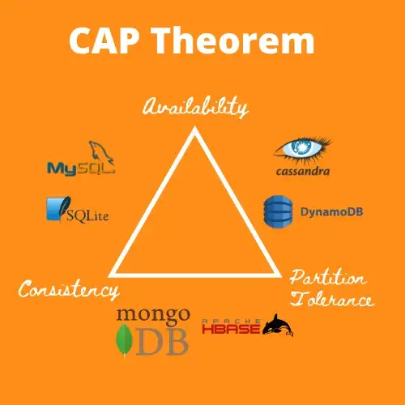

# SQLite

### Ines Cortina, Aarjav Jain, and Rob Woodward-Massey

 

---

# SQLite

### Background

- Most widely deployed database in the world
- Can be easily embedded into other software
- Fully self-contained
- Serverless
- Reads and writes directly to ordinary disk files
- Wide range of uses: web browsers, commercial airplanes and WhatsApp.

---

### History

- Developed by Richard Hipp in the year 2000
- As an alternative to Informix
  
- Built to store data used on a battleship
- The result was a very compact database, < 250 kilobytes

---

### History

Based on **PostgreSQL** - "_What would PostgreSQL do?_"

##### _KEY DIFFERENCES:_

|              | SQLite                                       | PostgreSQL          |
| ------------ | -------------------------------------------- | ------------------- |
| _DBMS_       | Embedded                                     | Client-server model |
| _Setup size_ | <500 kB                                      | ~200 MB             |
| _Data Types_ | NULL, BLOB, INTEGER, TEXT, REAL              | Any?                |
| _etc..._     | Portability, access, functionality, speed... | -                   |

---

# SQLite

### File format

- Multiple tables, indices, triggers, and views contained in a single disk file
- Stable, cross-platform, and backwards compatible
- SQLite database files are commonly used:
  - As containers to transfer content between systems
  - As a long-term archival format for data
- Source code is in the public-domain

---

# SQLite

### Design and Architecture Overview

- "**SQLite** is a **C-language** library that implements a **small, fast, self-contained, high-reliability, full-featured, SQL database engine**"
   
- "The SQLite file format is **stable, cross-platform, and backwards compatible**"
   

  &nbsp;&nbsp;&nbsp;&nbsp;&nbsp;&nbsp;&nbsp;&nbsp;&nbsp;&nbsp;&nbsp;&nbsp;&nbsp;&nbsp;&nbsp;&nbsp;&nbsp;&nbsp;&nbsp;&nbsp;&nbsp;&nbsp;&nbsp;&nbsp;&nbsp;&nbsp;&nbsp;&nbsp;&nbsp;&nbsp;&nbsp;&nbsp;&nbsp;&nbsp;&nbsp;&nbsp;&nbsp;&nbsp;&nbsp;&nbsp;&nbsp;&nbsp;&nbsp;&nbsp;&nbsp;&nbsp;&nbsp;&nbsp;&nbsp;&nbsp;&nbsp;&nbsp;&nbsp;&nbsp;&nbsp;&nbsp;&nbsp;&nbsp;&nbsp;&nbsp;&nbsp;&nbsp;&nbsp;&nbsp;&nbsp;&nbsp;&nbsp;&nbsp;&nbsp;&nbsp;&nbsp;&nbsp;&nbsp;&nbsp;&nbsp;&nbsp;&nbsp;&nbsp;&nbsp;&nbsp;&nbsp;&nbsp;&nbsp;&nbsp;&nbsp;&nbsp;&nbsp;&nbsp;&nbsp;&nbsp;&nbsp;&nbsp;&nbsp;&nbsp;&nbsp;&nbsp;&nbsp;&nbsp;&nbsp;&nbsp;&nbsp;&nbsp;&nbsp;&nbsp;&nbsp;&nbsp;&nbsp;&nbsp;&nbsp;&nbsp;- _from sqlite.org_

---

### Design and Architecture Overview

**Serverless** - Not client-server, but an _embedded_ database

 

---

# SQLite

### Design and Architecture Overview

- **Zero-configuration**
  - Only disk file access required
     
- **Transactional SQL database engine**
  - Follows **ACID**
  - Atomic, Coherent/Consistent, Isolated, and Durable

---

### Design and Architecture Overview - ACID

- **Atomic**
  - all database operations in the transaction must succeed
- **Coherent/Consistent**
  - all database operations must satisfy the database rules and leave the database in a valid state
- **Isolated**
  - concurrent transactions must leave the database in the same state as that if the transactions were run sequentially
- **Durable**
  - once the database has confirmed the transaction has been committed, the database must retain the changes if an unexpected error occurs

---

# Where does it fall on the CAP model?

SQLite = **Consistent** and **Available** - but _not tolerant_ to **Partitions**

### &nbsp;&nbsp;&nbsp;&nbsp;&nbsp;&nbsp;&nbsp;&nbsp;&nbsp;&nbsp;&nbsp;&nbsp;&nbsp;&nbsp;&nbsp;&nbsp;&nbsp;&nbsp;&nbsp;&nbsp;-->>&nbsp;&nbsp;&nbsp;&nbsp; SQLite = CA

 

&nbsp;&nbsp;&nbsp;&nbsp;&nbsp;&nbsp;&nbsp;&nbsp;&nbsp;&nbsp;_(Aside - who made this grim diagram?)_ 

---

## Pros and Cons

### Lightweight & Portable

- So used as embedded software with TVs, phones, cameras, home electronics etc
- Fast & only overwrites edited parts of file
- Compatible with all programming languages
- Open source

### Reliable

- Updates data continuously, minimal loss in power loss event
- Content updated with concise SQL queries

---

# SQLite

## Pros and Cons

### Disadvantages

- Used to handle low to medium traffic HTTP requests (generally <100k hits/day, most!)
- Not suitable if concurrency required: unlimited readers, one writer, rest queue up

---

## Popularity - SQLite is found in:

- Every Android device
- Every iPhone and iOS device
- Every Mac
- Every Windows10 machine
- Every Firefox, Chrome, and Safari web browser
- Every instance of Skype
- Every instance of iTunes
- Every Dropbox client
- Every TurboTax and QuickBooks

---

## Popularity - cont.

- PHP and Python
- Most television sets and set-top cable boxes
- Most automotive multimedia systems
- Countless millions of other applications

 

## It is estimated that there are over one trillion SQLite databases in active use!
