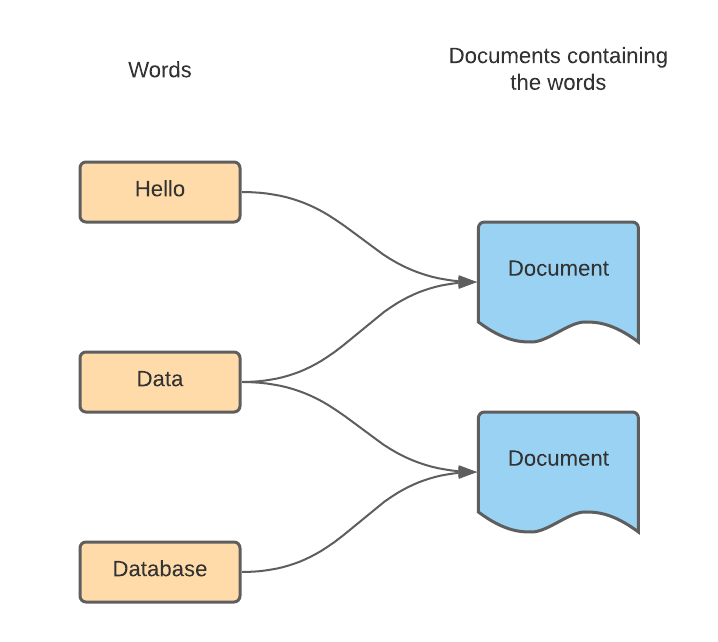

# Discovering Data

---

What is data?

---

## Databases

Need to store data that is safe beyond the execution type of the application.  

---

## Types Of Data

---

# Types Of Data
####  Structured vs Unstructured

||Structured|UnStructured|
--|--|--
|**Examples**| Numbers, Dates, Strings | Images, Log files, Videos
|**Can be tabulated** | Yes | No
|**Types of Database** | RDMS, CSV files | NoSQL, File Systems, Object Store

---
 # Spreadsheets and CSV Files

---

# Things to consider when using flat files.

 **Storing**
    How to manage multiple files on the disk and manage the structure in those files to allow effective access and update

**CRUD**
    Methods to: (C)reate, (R)ead, (U)pdate and (D)elete data

---

# More things to consider when using flat files.

**Consistency**
    Ensure the data is in a consistent state especially during concurrent changes

**Resilience / Reliability**
    Make sure we have access to the data is something goes wrong

---

# More things to consider when using flat files. 

**Security**
    Store the data in a way that restricts access to parties/clients that have permission to read and use the data

---

# DBMS = DataBase Management System

Abstraction of data storage systems that hides the complexities of data storage and management behind a standard interface.

DBMS is software that manages:
* Storing 
* Resilience and Reliability
* Consistency
* Security
* CRUD

Examples:  Microsoft Sql Server, Oracle RDMS, Postgresql

Also: SQLLite

---

# Types of DBMS

---

# Database CAP Theorem

|CAP| Meaning | Description
|---|-----|---
| C | Consistency | All clients see the same data
| A | Availability | All clients get a response
| P | Partition Tolerant | Work if communication fails between nodes

---

 # Applications Considerations

  | CAP | Considerations |
  |---| ---------------|
  | CA | Queries can block to keep data consistent, scaling up is very hard and hampers performance |
  | AP | Its possible to read out of date data, shows eventually consistent behaviour.  Can still read/write if a partition fails
  | CP | Ability to read/write data could be lost if a partition fails, data is safe.

---

# Eventual Consistency

Not all nodes in a database cluster will give the same data at any point in time, but given enough time all the nodes will give the same result.

Gives Availability in CAP.

---

# Major Types of Databases

---

# Relational Database

**Examples:** Microsoft SQL Server,MySQL, Maria, PostgreSQL

**Used For:**  Storing Tabulated Data

---

# Inverted Indexes 

**Example:** Elastic Search

**Used For:**  Search engines, Google

---

## Graph Databases

**Examples:** Neo4J

**Used For:**  Data where the relationship is as important as the data

---

## Columnar DBs

**Examples:** Cassandra

**Used For:** Analytics with large datasets

--- 

## Document Stores

**Examples:** CouchDB, MongoDB

**Used For:** Schema-less applications, document format can be different

---

## KV Stores

**Used For:** Small amounts of data, distributed databases, service discovery mechanisms

---

## Hybrid

**Examples:** Cockroach DB

**Used For:** KV Store with layer on top to make it look like RDMS

---

## Cloud Databases

AWS Aurora
Google BigTable
Amazon Redshift

---

# Exercise 

In groups of 3 or 4 write a 15 minute talk about your given database that you can give to the rest of the group next week.  This must include the following

* Some background to the database system
* Overview of the design and architecture of the system
* Where does it fall in the CAP model, Why?
* Describe some use cases of the database
* Pros and Cons of the database
* Anything else interesting. 

