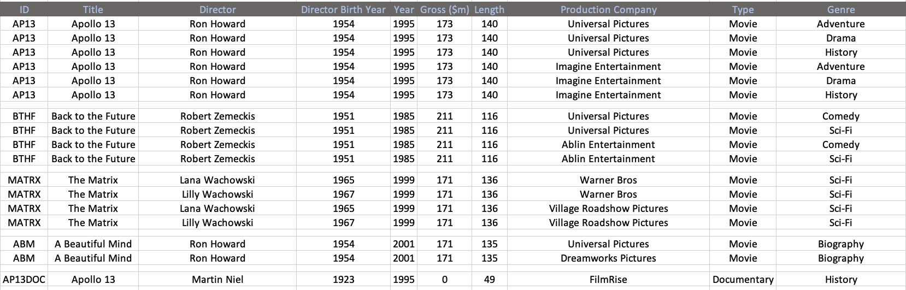

# Relational Databases and Data Modelling

---

# Relational Databases

Lots of data can tabulated and stored in a number of flat files, or spreadsheet tabs.  This type of data can be stored and management by a Relational Database (RDMS).

---

# Relational Database Nomenclature

Name | Meaning | Excel Equiv.
-----|:------|:------
**Table** | Sets of data that confirm to the same format. | Data Sheet
**Field** | Named data of a particular data type. | Column
**Key**  | Data structures that define the consistency of the data. | Supported by user
**Index** | Data structures that aim to increase performance of finding and changing data.| Supported by user
**Transaction**  | Concept of controlling atomic updates to data.| Supported by user

---

RDMS require the definition of the data structure ahead of time.

How best can we store this data

* Human understanding and ease of use
* Computing resource utilization (storage/compute)
* Query performance

--- 

## Entity Relationship Diagrams (ERDs)

A formal notation syntax for representing relational data models.

---

## Tables and Data types

 

---

# Important Data Types

Name | Aliases |Description
-----|:---------|:------
bigint|int8|signed eight-byte integer
boolean|bool|logical Boolean (true/false)
character [ (n) ]|char [ (n) ]|fixed-length character string
character varying [ (n) ]|varchar [ (n) ]|variable-length character string
date| |calendar date (year, month, day)
double precision|float8|double precision floating-point number (8 bytes)
integer|int, int4|signed four-byte integer

---

Name | Aliases |Description
-----|:---------|:------
money| |currency amount
numeric [ (p, s) ]|decimal [ (p, s) ]|exact numeric of selectable precision
real|float4|single precision floating-point number (4 bytes)
smallint|int2|signed two-byte integer
text| |variable-length character string

---

Name | Aliases |Description
-----|:---------|:------
time [ (p) ] [ without time zone ]| |time of day (no time zone)
time [ (p) ] with time zone|timetz|time of day, including time zone
timestamp [ (p) ] [ without time zone ]| |date and time (no time zone)
timestamp [ (p) ] with time zone|timestamptz|date and time, including time zone

Full list in Postgresql Documentation

---

# Constraints

---

# Primary Keys

Primary Key | Composite Key |
------- | ------
 | 

Unique identifier for each row in a table

---

# Foreign Keys

A attribute that is a reference to a primary key in a different table

---

# Relationships - Cardinality

---

# Optimising models

---

# Normalisation

Organising data into tables in order to:

* minimise reduntant or duplicated data
* avoid data modification issues   
* make more logical structure

--- 

# Insert Anomaly

Need more data to create a record

Employee_Id | Sales_Person | Sales_Office |  Office_number | Customer1 | Customer2 | Customer3
-----|:------|:------|:------|:------|:------|:------
1003 | Mary Smith | Chicago | 312-555-1212 | Ford | GM | |
1004 | John Hunt | New York | 212-555-1212 | Dell | HP | Apple
1005 | Martin Hap | Chicago | 312-555-1212  | Boeing
???  | ???  | Atlanta | 212-555-1212

---

# Update Anomaly

Potential data inconsistances

Employee_Id | Sales_Person | Sales_Office |  Office_number | Customer1 | Customer2 | Customer3
-----|:------|:------|:------|:------|:------|:------
1003 | Mary Smith | Chicago | 312-555-1212 | Ford | GM | |
1004 | John Hunt | New York | 212-555-1212 | Dell | HP | Apple
1005 | Martin Hap | Chicago | 312-555-1212  | Boeing
1005 | Martin Hap | Chicago | 312-555-1212  | Boeing

---

# Delete Anomaly

Data from multiple facts removed

Employee_Id | Sales_Person | Sales_Office |  Office_number | Customer1 | Customer2 | Customer3
-----|:------|:------|:------|:------|:------|:------
1003 | Mary Smith | Chicago | 312-555-1212 | Ford | GM | |
1004 | John Hunt | New York | 212-555-1212 | Dell | HP | Apple
1005 | Martin Hap | Chicago | 312-555-1212  | Boeing
1005 | Martin Hap | Chicago | 312-555-1212  | Boeing

---

# Normal Forms - 1st Normal Form

 * Each field should have a single entry
 * Each entry in a field should be the same type for each row
 * Each row has a primary key (can be identified)

---

# Normal Forms - 2nd Normal Form

 * All fields depend on the primary key.  i.e. Are all the fields about the same "thing" 

---

# Normal Forms - 3rd Normal Form

 * All fields can be determined only by the primary key and no other field.  i.e. Data should not be repeated in the same table

---

### Example

 

### Problems

 

---

### Example 1NF

 

---

### Example 2NF

 

---

### Example 2NF - Linking tables

 

---

### Example 3NF

 

---

### Example 3NF

 

---

### Denormalisation

In a few circumstances it may me necessary to denormalise some data in the physical data store for reasons of improved performance and take the overhead of keeping that data consistent.  This is rare but you may stumble across it in THG schemas

---

## Summary

* ER Diagrams
* Tables and Keys
* Optimising models
* Normalisation

---

https://www.youtube.com/watch?v=UrYLYV7WSHM