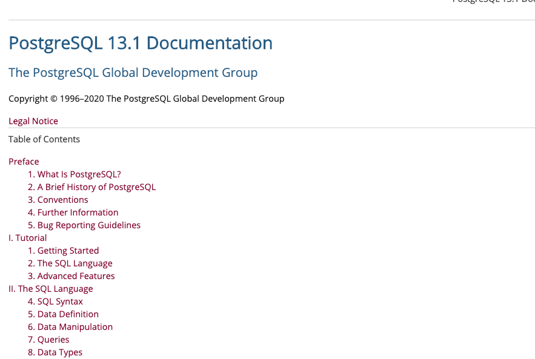

# SQL and Querying

--- 

# SQL

Structured Query Language

"See-Qul"

---
# Types of SQL Command

| DML | DDL | DCL | TCL |
|-----|-----|-----|-----|
| Data Manipulation Language| Data Definition Language | Data Control Language | Transaction Control Language |
| **Select** | **Create** | **Grant** | **Commit** |
| **Insert** | **Alter** | **Revoke** | **Rollback** |
| **Update** | **Drop** | | |
| **Delete** |  | | | 


---

# DDL

---

# Creating tables

```sql
CREATE SCHEMA imdb
    AUTHORIZATION postgres;

CREATE TABLE imdb.Title_Type
(
    title_type_id int NOT NULL PRIMARY KEY,
    title_type_name varchar(255)
);

CREATE TABLE imdb.Title
(
    title_id varchar(25) NOT NULL PRIMARY KEY, 
    title_type_id int NOT NULL REFERENCES imdb.Title_Type (title_type_id),
    title varchar(255),
    start_year int,
    end_year int,
    runtime_minutes INT
);
```
----

# DML

---

# Insert

 
 ```sql
INSERT into imdb.Title (title_id, 
                title_type_id, 
                title, 
                start_year, 
                end_year, 
                runtime_minutes)
values ('TG43',3 ,'New title',1980,1981, 33)
```
---

# Update


 ```sql
UPDATE imdb.Title
    SET title = 'New title'
WHERE
    title_id = 'TG43'
```

---

# Select - From - Where

```sql
SELECT 
    title_id,
    title
FROM
    imdb.Title
WHERE
    end_year > 1960

```

---
# Joins

```sql
SELECT 
    title_id,
    title
FROM
    imdb.Title t
    join
    imdb.Title_Type tt
    on t.title_type_id = t.title_type_id
WHERE
    end_year > 1960

```

---

# Types of Joins


 


---

## Group By

```sql
SELECT
    title_type_id,
    count(title_id)
FROM
    imdb.Title
GROUP BY
    title_type_id
```
---

## Having
```sql
SELECT
    title_type_id,
    count(title_id)
FROM
    imdb.Title
GROUP BY
    title_type_id
HAVING
    count(title_id) > 40

```

---

## NULL special meaning

* NULL means represents missing data or unknown values
* NULL isn't equal to anything: ```NULL = NULL``` is false
* Use ``` IS NULL ``` and is ``` IS NOT NULL```

---
## Things to look into


```LIMIT```
```SUM```, ```MAX```, ```AVG``` etc
```ALTER TABLE```

---

## Documentation and Reference

 https://www.postgresql.org/docs/

 


--- 
## Summary

* Overview of SQL queries
 * create tables 
 * query, insert, update
 * PostSQL Documentation

 